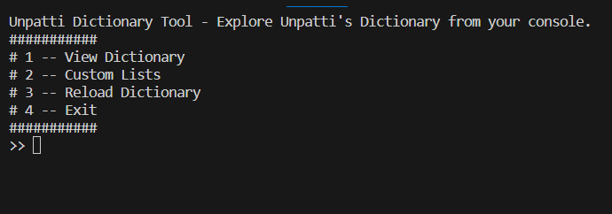
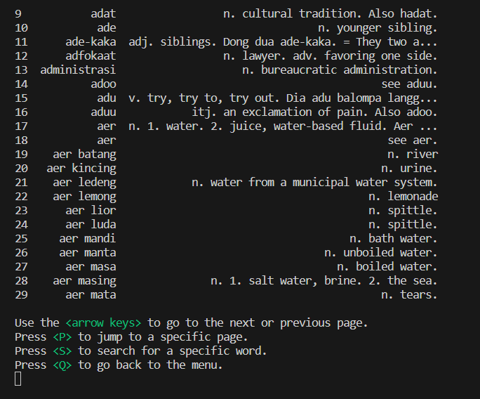
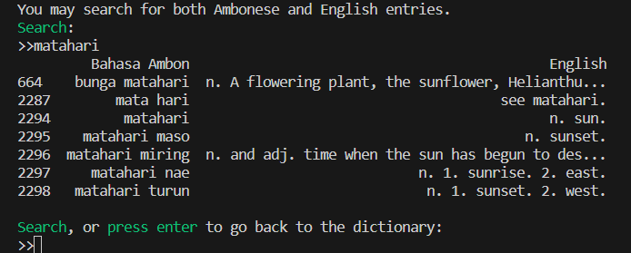
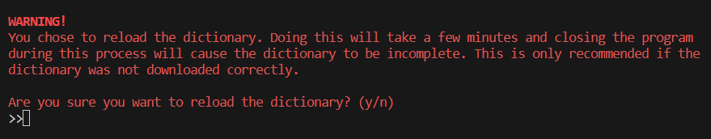

<h1 align="center">dictunpatti-tool</h1>

<p align="center">
Tool for browsing UnPatti's Ambonese - English dictionairy, creating custom practice lists, do tests etc.
This tool was created because I was unable to search from English to Ambonese and I wanted to be able to do so. 
After accomplishing this, I added features for assembling practice lists and quizzing yourself using these lists.
Most of the progress of this tool was lost over a year ago. This project is a work-in-progress remake of the original
version of the tool.
</p>
<h6>
Link to Unpatti's dictionary: https://dict.unpatti.ac.id/
</h6>

## Table of Contents
- [Features](#features)
- [Installation](#installation)
- [Usage](#usage)
- [Contributing](#contributing)
- [License](#license)

## Features
- Save the dictionary in a .csv file
- Search function
- Jumping to page
- Next/previous page on key press
- Go back to page after using search function
- Reload the dictionary (if .csv file has been lost/corrupted)

## Installation
Use the following command to install all libraries used for this project.

```
pip install -r requirements.txt
```

## Usage

### Running the tool
Run the tool using your preferred IDE. The tool wil check if the dictionary (```dict.csv```) exists. If not, the dictionary will be saved as ```dict.csv```. This may take a while.

If the dictionary exists/is downloaded, a menu will appear.


Currently, only option 1 (view dictionary), option 3 (reload dictionary) and option 4 (Exit) are implemented. Type '1' and press enter to view
the dictionary.

### Dictionary
The dictionary is divided in 127 pages. The ```arrow keys``` (```< >```) are used for going to the previous/next page.
To jump to a specific page, press ```P``` and type a page number to jump to. 


Search for letters, words or sentences by
pressing ```S``` and typing a search request. The tool searches in both the Ambonese and the English columns and it returns every instance of the search request found. Press ```Enter``` to return to the dictionary. From here, press ```Q``` to return to the menu.


### Reload dictionary
When the dictionary is for whatever reason corrupted, it's possible to reload it from within the tool. In the menu, type 3 and press enter. A warning will be shown and you need to confirm if the dictionary needs to be reloaded by typing ```y``` for yes or ```n``` for no. Typing ```n``` makes the tool return to the menu, typing ```y``` will start the download.



## Planned features
For the tool to return to it's former glory, it needs to allow the user to save entries to a custom list. The user must also be able to add their own entries to their custom list. The tool also needs a function that quizzes the user, using the custom list. 

If these features are added, the tool will have the same features as the original version (but likely better).
